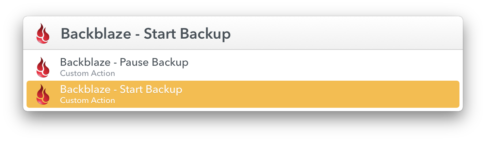

# Backblaze Actions For LaunchBar

 

Allows you to start and pause a Backblaze backup from LaunchBar. For all you control freaks who don't like to let Backblaze back up continuously.

## Usage

The actions are named `Backblaze - Start Backup` and `Backblaze - Pause Backup`. Simple enough. Better yet, if you select the Backblaze app in LaunchBar, you can tap the right arrow key to find the actions.

## Installation

Either:

- Clone this repo into your LaunchBar Actions folder like so:

```bash
$ cd ~/Library/Application\ Support/LaunchBar/Actions/ && git clone git@github.com:eirkeirkeirk/backblaze-launchbar-actions.git
```

Or...

- Download the archive and double-click on each of the `.lbaction` files to let LaunchBar install them for you
